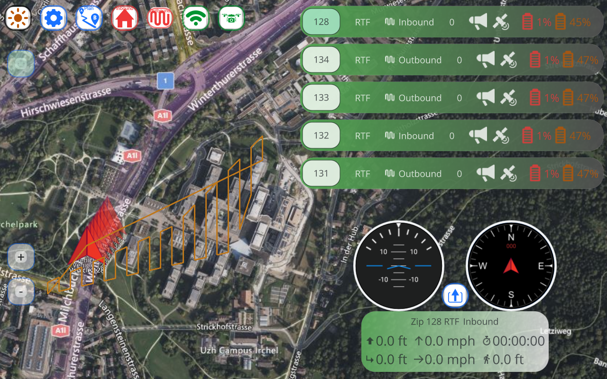

# Custom QGroundControl Ground Control Station

# Customized QGroundControl 

To build this sample custom version:

* Clean your build directory of any previous build
* Replace the directory `custom-example` of upstream qgroundcontrol with a clone of this git 
* Rename `customqgc` to `custom` directory
* Build QGC

